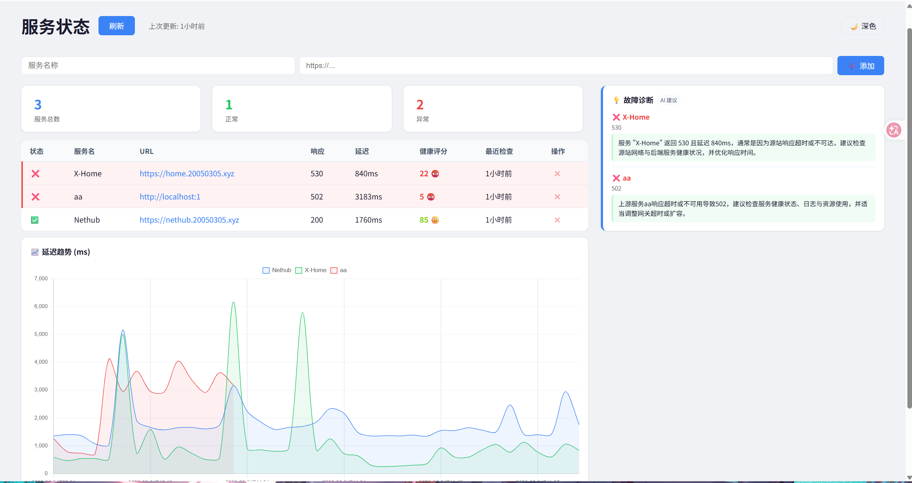

<h1 align="center">🛡️ 服务哨兵 · Service Sentinel</h1>

<p align="center">
  <b>5 分钟部署 · 零配置 · 带 AI 诊断的轻量级服务监控面板</b>
</p>

<p align="center">
  
  
  
</p>

---

## 📖 看板样式

<p align="center">
  
</p>

---


## ✨ 核心功能

| 功能 | 说明 |
|------|------|
| ✅ **实时状态看板** | 所有服务状态一目了然，正常/异常分类展示 |
| 📈 **延迟趋势图** | 每个服务的响应时间变化，提前发现性能劣化 |
| 🤖 **AI 故障诊断** | 服务异常时自动调用 LLM 分析根因并给出修复建议 |
| 📊 **健康评分** | 0-100 综合评分，结合延迟 + 近期故障次数 |
| 🔔 **Webhook 告警** | 状态变更时通过飞书/钉钉推送通知 |
| 🌙 **深色模式** | 一键切换，夜间使用不刺眼 |
| ➕ **动态管理** | 直接在 UI 上添加/删除服务，无需改配置 |
| 🐳 **Docker 部署** | 一条命令启动，支持 docker-compose |
| 📱 **移动端适配** | 手机浏览器也能正常查看 |

---

## 🚀 快速开始

### 方式一：Docker（推荐）

```bash
docker run -d \
  -p 5000:5000 \
  -v ./config.json:/app/config.json \
  -e WEBHOOK_URL=your_webhook_url \
  -e LLM_API_KEY=your_api_key \
  ghcr.io/kkivc/service-healthcheck:latest
```

### 方式二：docker-compose

```bash
git clone https://github.com/KKiVC/service-healthcheck.git
cd service-healthcheck
docker-compose up -d
```

### 方式三：本地运行

```bash
git clone https://github.com/KKiVC/service-healthcheck.git
cd service-healthcheck
pip install -r requirements.txt

# 配置服务 (编辑 config.json)
# 启动 web 面板
python web.py

# (可选) 启动后台定时检查
python healthcheck.py --interval 300
```

访问 http://localhost:4000 即可看到看板。

---

## 📝 配置指南

### 环境变量

| 变量 | 必填 | 说明 | 默认值 |
|------|------|------|--------|
| `WEBHOOK_URL` | 否 | 飞书/钉钉 Webhook 地址，异常时推送告警 | - |
| `LLM_API_KEY` | 否 | LLM API 密钥，开启 AI 诊断 | - |
| `LLM_API_URL` | 否 | LLM API 地址 | - |
| `LLM_MODEL` | 否 | LLM 模型名称 | - |

### config.json

```json
{
  "services": [
    { "name": "我的博客", "url": "https://blog.example.com" },
    { "name": "API 服务", "url": "https://api.example.com/health" }
  ]
}
```

---

## 🏗️ 技术架构

```
┌─────────────────────────────────────┐
│          浏览器 (HTML + Chart.js)     │
└──────────────┬──────────────────────┘
               │ HTTP
┌──────────────▼──────────────────────┐
│      Flask Web 服务 (web.py)         │
│  - 仪表盘渲染                        │
│  - REST API (增/删服务)              │
│  - LLM 诊断调用                      │
└──────────────┬──────────────────────┘
               │
┌──────────────▼──────────────────────┐
│         SQLite 数据库                │
│  每次检查结果 → records 表           │
│  自动保留最近 100 条                 │
└─────────────────────────────────────┘
```

---

## 🗺️ 产品路线图

| 阶段 | 状态 | 内容 |
|------|------|------|
| **Phase 1: MVP** | ✅ 已完成 | HTTP 检查、Web 看板、Webhook 告警、Docker 部署 |
| **Phase 2: 智能增强** | 🔄 进行中 | AI 诊断、延迟趋势图、健康评分、深色模式 |
| **Phase 3: 生态扩展** | 📋 规划中 | Ping/TCP 监控、SSL 证书检测、服务分组 |
| **Phase 4: 平台化** | 💡 构想 | 公开状态页、多用户、全球多节点 |


---

## 📂 项目结构

```
├── web.py                    # Flask web 应用
├── healthcheck.py            # 核心检查引擎
├── config.json               # 服务配置
├── requirements.txt          # Python 依赖
├── Dockerfile                # Docker 构建
├── docker-compose.yml        # Docker 编排
├── templates/
│   └── index.html            # 仪表盘页面
├── docs/
│   ├── PRD.md                # 产品需求文档
│   ├── roadmap.md            # 产品路线图
│   └── user-stories.md       # 用户故事 & 用例
└── screenshots/              # 产品截图
---

<p align="center">
  Made by <a href="https://github.com/KKiVC">KiKi</a>
</p>
